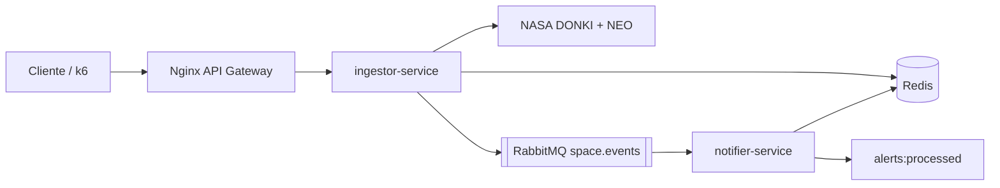
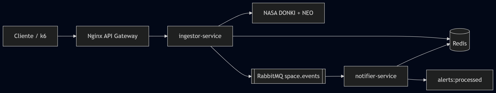

# Solar Shield

Projeto da disciplina Microservice and Web Engineering & IT Services para a Global Solution 2026.1.

## Integrantes

| Nome                    | RM       | GitHub | Responsabilidades |
|-------------------------|----------|--------|-------------------|
| Tony Khaled Osman       | RM553050 | https://github.com/TonyOsman | ingestor-service, integracao NASA DONKI/NEO, RN1/RN2, endpoints REST, retry/backoff, Nginx e Docker Compose |
| Inacia dos Santos Silva | RM553401 | https://github.com/ArttemiZ | notifier-service, RabbitMQ consumer, Redis, RN3 idempotencia, persistencia dos alertas, testes unitarios e k6 |

## Objetivo

O Solar Shield monitora clima espacial usando dados publicos da NASA. A aplicacao consome eventos DONKI de tempestades geomagneticas, classifica o risco pelo indice Kp, cruza eventos severos com dados NEO e publica alertas para processamento assincrono.

## Arquitetura





## Regras de negocio

| Kp | classification | emergency_notification |
|---|---|---|
| Kp <= 4 | low | false |
| 5 <= Kp <= 7 | moderate | false |
| Kp >= 8 | severe | true |

- RN1: classificacao por Kp.
- RN2: eventos severe recebem `neo_hazardous_count` com asteroides potencialmente perigosos no NEO Feed.
- RN3: o notifier usa `event_id` com Redis `SET NX EX 86400` para nao processar duplicatas.

## Cache

O endpoint `GET /api/space-weather/current` usa cache-aside no Redis com TTL de 60 segundos. Esse TTL reduz chamadas repetidas para a NASA e evita estourar rate limit, sem prejudicar o MVP, porque o indice Kp trabalha em janelas de horas.

## Resiliencia

As chamadas para a NASA usam timeout de 5 segundos e retry com backoff exponencial em erros transientes: timeout, falha de rede, HTTP 429 e HTTP 5xx. Erros 4xx, exceto 429, nao sao repetidos.

## Como executar

```bash
cp .env.example .env
docker compose up --build
```

Servicos com Docker Compose:

- API Gateway: `http://localhost:8080`
- RabbitMQ UI: `http://localhost:15672` (`guest` / `guest`)
- Redis: `localhost:6379` (servico TCP, nao abre no navegador)

Ao rodar apenas o JAR local do ingestor, somente `http://localhost:8080` fica disponivel. RabbitMQ e Redis precisam estar rodando via Docker Compose para as portas `15672`, `5672` e `6379` abrirem.

## Endpoints

| Metodo | Rota | Descricao |
|---|---|---|
| GET | `/` | Resumo da API |
| GET | `/api/space-weather/current` | Clima espacial atual com cache |
| POST | `/api/space-weather/ingest` | Ingestao DONKI e publicacao no RabbitMQ |
| POST | `/api/ingest/gst` | Alias da ingestao |
| GET | `/api/neo/feed?date=YYYY-MM-DD` | NEOs da janela consultada |
| GET | `/api/alerts` | Alertas processados |
| GET | `/health` | Health check |

## Testes

```bash
mvn test
```

Smoke test:

```bash
docker run --rm --network host -i grafana/k6 run - < k6/smoke.js
```

Rate limiting:

```bash
for i in $(seq 1 50); do curl -s -o /dev/null -w "%{http_code}\n" http://localhost:8080/api/space-weather/current; done
```

## Checklist

- Dois microsservicos Java 17 com Spring Boot em containers separados.
- RabbitMQ com producer e consumer.
- Idempotencia por `event_id`.
- Redis com cache-aside e TTL justificado.
- Retry com backoff em chamadas NASA.
- Nginx com proxy reverso e rate limiting.
- Docker Compose sobe a infraestrutura.
- Tres testes unitarios cobrindo RN1, parsing DONKI e RN3.
- k6 com 10 VUs por 10 segundos.
- README com diagrama Mermaid.
